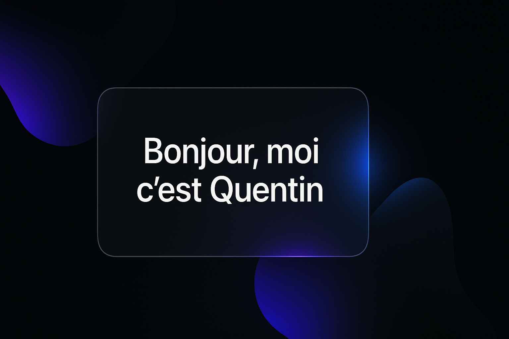

  

---

<h2 align="center">👨‍💻 Quentin Zampieri – Développeur Fullstack Java</h2>

📍 France · 🔁 Toujours en apprentissage · 🎯 Passionné par les expériences fluides et la qualité logicielle

---

## 🚀 Projets phares

🎯 **[Groupsmaker](https://github.com/Quentin384/groupsmaker)**  
> Générateur intelligent de groupes d’apprenants (Simplon)  
> ✅ Objectif : équilibre selon critères (niveau, genre, ancienneté…)  
> 🧰 Stack : Angular · Spring Boot · JWT · PostgreSQL

💼 **[Mini-ERP](https://github.com/Quentin384/mini-erp-java)**  
> Application Java Desktop de gestion commerciale  
> ✅ Objectif : stock, commandes, clients — interface Swing  
> 🧰 Stack : Java · AWT/Swing · JDBC · MVC

---

## 🧰 Stack & outils préférés

| Frontend | Backend | Bases de données | Outils & DevOps |
|----------|---------|------------------|-----------------|
| Angular, HTML/CSS, TypeScript | Java, Spring Boot, Node.js | PostgreSQL, MySQL, MongoDB | GitHub Actions, Docker, Figma |

  

---

## 🎯 Ma vision du développement

> “Un bon développeur, c’est celui qui résout des problèmes avec simplicité, sans sacrifier la qualité.”  
> — Refactoring, clarté, accessibilité, et expérience utilisateur sont mes piliers.  
> J’accorde de l’importance au **clean code**, à **l’architecture bien pensée** et à l’**expérience fluide**, quelle que soit la techno.

---

## 📊 Statistiques GitHub

  
   
  

---

## 📫 Me contacter

  
  

